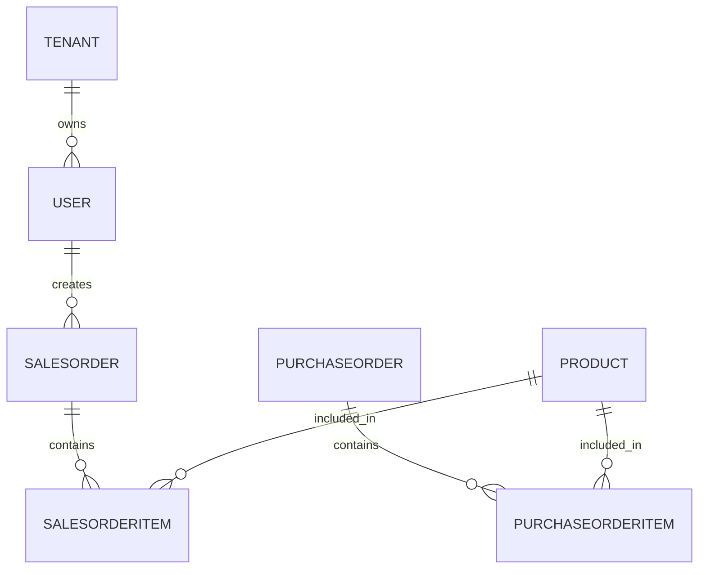

---

### 3️⃣ `docs/database_schema.md`

```markdown
# 🗄️ Database Schema (MVP)

## Entities
- **Tenant**
  - `name`, `domain_url`, `schema_name`
- **User**
  - `email`, `password`, `role` (Admin/Manager/Staff)
- **Product**
  - `name`, `sku`, `barcode`, `quantity`, `cost_price`, `sale_price`
- **Supplier**
  - `name`, `contact_info`
- **PurchaseOrder**
  - `supplier`, `status` (Pending/Received), `created_at`
- **SalesOrder**
  - `customer_name`, `payment_status`, `created_at`
- **Invoice**
  - `sales_order`, `pdf_url`

## Diagram


🔄 Data Flow
flowchart TD
    ReactUI[React Frontend] -->|Fetch API| DRF[DRF Endpoints]
    DRF -->|Query| DB[(PostgreSQL)]
    DRF -->|Async Jobs| Celery[Celery Worker]
    Celery --> Redis[(Redis Broker)]
    DRF -->|JWT Tokens| ReactUI

🚀 Deployment Plan

Backend: Deployed with Gunicorn (ASGI) + Django on Render/Railway

Frontend: Built React app served via Django (or static host like Netlify)

Database: PostgreSQL managed by cloud provider

Redis: Hosted Redis (Render/Upstash) for Celery task queue

CI/CD: GitHub Actions runs tests, builds, deploys automatically on main


---